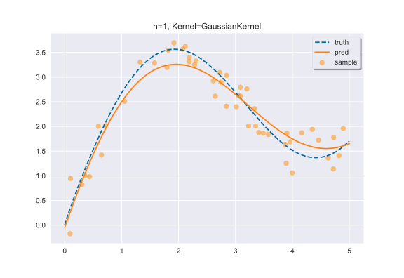
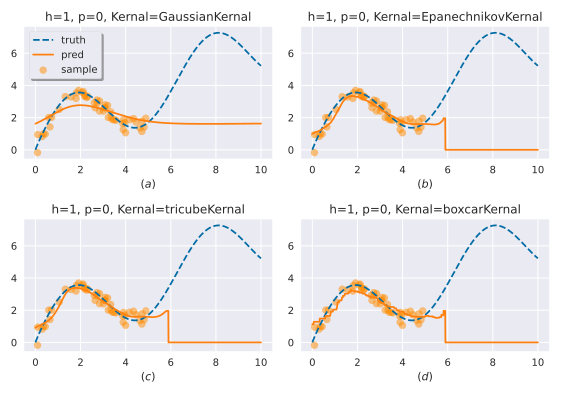
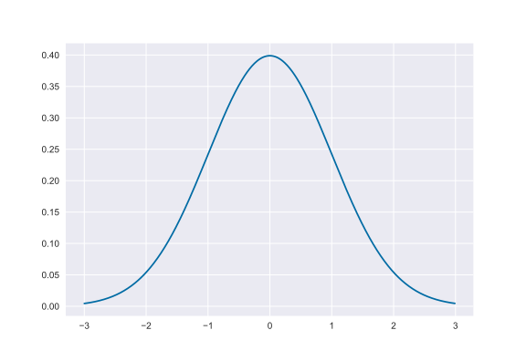

## 🚀下载
`
pip install nonpapy
`

## 🎉快速开始
```python
import numpy as np
import nopapy as npp

x = np.array([1, 2, 3, 4, 5])
y = np.array([2, 4, 6, 8, 10])
ypred = npp.NWEstimate(x, y, 3.5) # supposed to be 7
print(ypred) # 6.910633194984344
```

## 🎨其他功能模块
- kernel: 支持多种内置核函数，同时支持自定义核函数
- estimate: 包含多种非参数估计方法，允许自定义核函数、光滑带宽、阶数
- regression: 提供多种光滑方法进行批量预测
- scikit_like: 支持像scikit-learn和PyTorch生成特定参数的回归对象，传递自变量即可获得预测值

## 🎰案例: Estimate & Regression
## 案例1: Estimate
首先，你需要引入一些必要的库，包括numpy和nopapy，这里我们只需要GaussainKernel和LPEstimate。
如果你还想绘图，那么你需要引入matplotlib。 

为了复现这个案例的结果，我们建议你设定种子，并且设定matplotlib的样式。
```python
import numpy as np
from nopapy import GaussianKernel, LPEstimate
import matplotlib.pyplot as plt

np.random.seed(0)
plt.style.use('seaborn') # do not delete this, plz:)
plt.style.use('tableau-colorblind10')
```

第二步，构建一个函数:
$$f(x) = 2 \sin(x) + x^{0.8}$$
假设我们的样本来自于这个函数，自变量的范围是$[0, 5]$，因变量则是$f(x)$的值加上随机噪声。 xs0代表我们想要用非参数回归方法拟合的目标点。
```python
def f(x):
    return 2 * np.sin(x) + x ** 0.8

sample_number = 50
x = np.sort(np.random.rand(sample_number) * 5)
y = f(x) + np.random.normal(loc=0, scale=0.3, size=(sample_number,))
xs0 = np.arange(0, 5.01, 0.01)
```
现在我们就可以进行拟合了，在这里采用了GaussianKernel和LPEstimate，并且设置LPEstimate的阶数为2。
实际上，你可以自由选择核函数和回归方法，唯一的区别是其它回归方法不需要参数p。
```python
kernel = GaussianKernel; h = 1; method = LPEstimate; p = 2
y_pred = [method(x, y, x0, h, k=kernel, p=p) for x0 in xs0]
```
最后一步，将结果绘制出来，绘制的结果包含了样本点$(x, y)$，函数$f(x)$，以及我们的回归函数$g(x)$。
```python
plt.scatter(x, y, alpha=0.5, label='sample', c='darkorange')
plt.plot(xs0, f(xs0), '--', label='truth')
plt.plot(xs0, y_pred, label='pred')
plt.title('h={}, Kernel={}'.format(h, kernel.__name__))
plt.legend(loc='best', frameon=True, framealpha=1, shadow=True)
plt.show()
# plt.savefig('./LPR.svg', dpi=2000)``
```
绘制的结果应该如下图所示，你可以调整带宽，更换核函数，更换回归方法，甚至是设定阶数来观察拟合效果的不同。

<div align="center">
    
</div>

另外，在上面的例子中，我们传递了所有可以传递的参数，实际上许多参数都有默认值，必须要传递的参数只有 x/y/x0 。
例如
`
y_pred = [method(x, y, x0) for x0 in xs0]
`
。下面要介绍的Regression也拥有同样的性质，你可以省略掉那些不必要的参数。

## 案例2: Regression
其他步骤几乎是一样的，但是Regression方法的功能更强大，它能同时预测一系列的目标点。
```python
import numpy as np
from nopapy import GaussianKernel, LPRegression
import matplotlib.pyplot as plt

np.random.seed(0)
plt.style.use('seaborn') # do not delete this, plz:)
plt.style.use('tableau-colorblind10')

def f(x):
    return 2 * np.sin(x) + x ** 0.8

sample_number = 50
x = np.sort(np.random.rand(sample_number) * 5)
y = f(x) + np.random.normal(loc=0, scale=0.3, size=(sample_number,))
xs0 = np.arange(0, 5.01, 0.01)

kernel = GaussianKernel; h = 1; method = LPRegression; p = 2
y_pred = LPRegression(x, y, xs0, h, k=kernel, p=p)

plt.scatter(x, y, alpha=0.5, label='sample', c='darkorange')
plt.plot(xs0, f(xs0), '--', label='truth')
plt.plot(xs0, y_pred, label='pred')
plt.title('h={}, Kernel={}'.format(h, kernel.__name__))
plt.legend(loc='best', frameon=True, framealpha=1, shadow=True)
plt.show()
# plt.savefig('./LPR.svg', dpi=2000)
```
### ⚠️警告
你也可以像使用Estimate那样使用Regression，也就是只用Regression预测一个点，这不会为代码的正确性带来任何问题。
但是我们强烈不推荐这么做，因为这会导致一些性能上的问题。
如果你必须这么做，那么你会收到一个警告：
```
UserWarning: LPRegression() expects xs0 to be np.ndarray or list.
Your code won't make any errors, but we still recommend that you use LPEstimate() instead.
warnings.warn(warn_msg) 
```

### ⛔  做好别这么做...
你可能会想使用非参数回归进行外推预测，但是这并不是非参数回归的典型应用场景。
我们的代码中并没有对这种行为作出禁止，因为我们不确定您是否真的想这么做，例如：

<div align="center">
    
</div>

可以发现，除了GaussianKernel以外的回归方法都失效了，这是因为它们都间接使用到了示性函数$I(x)$。
而GaussianKernel的预测结果也不尽如人意，这是因为非参数回归采用的是"光滑方法"，这种方法仅对定义域内$[min(x), max(x)]$的值有效。

## 🎰案例: Kernel & Custom
## 案例1: Kernel
我们提供了多个现成的核函数，你可以直接将它们使用到相应的估计和回归方法中，同时，它们也可以单独使用，这可能对您的科研有所帮助。
您可以使用代码
`
npp.kernel.kernel.__all__
`
来查看所有的核函数。它们的使用方式较为灵活，你可以自由地选择：例如传递给它一个标量或者array。
```python
from nopapy import GaussianKernel
x = np.arange(-3, 3, 0.01)
y = GaussianKernel(x)
plt.plot(x, y)
plt.show()
```
<div align="center">
    
</div>

## 案例2: Custom

同时我们也支持您自定义核函数，核函数是一类具有特殊数学性质的函数，一般来说它们要满足以下的性质：

- 非负性: $f(x) \geq 0$
- 对称性: $E(x) =\int xK(x) dx=0$
- 概率密度: $\int K(x) dx=1$
- 方差为正: $D(x)=E(x^2)=\int x^2K(x) dx>0$

您实现的核函数$custom_kernel(x)$需要满足上述性质，一般而言，您可以通过搜索引擎搜索感兴趣的核函数，并将它实现为Python的函数。
我们提供了函数$I(x)$帮助您快速实现您的核函数，很多核函数都依赖于示性函数。例如：
```python
def EpanechnikovKernel(x):
    return EPANECHNIKOV_COEFFICIENT * (1 - np.power(x, 2)) * I(x)
```
PS: GaussianKernel是个例外，它拥有优雅的数学性质。

###👉 我的函数是否正确？
我们还提供了函数is_kernel用于检测您的核函数是否正确，它以一个函数作为输入，输出一个布尔值作为正确与否的标志。
```python
ret = is_kernel(GaussianKernel)
print(ret) # True
```